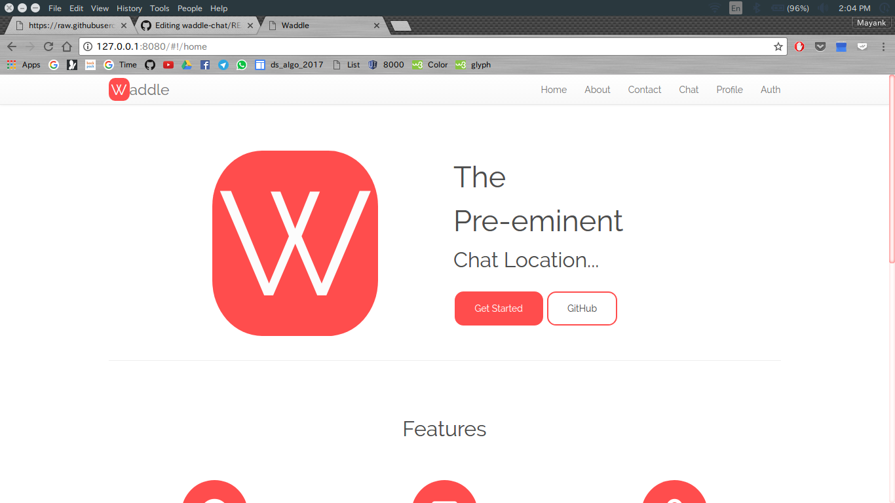
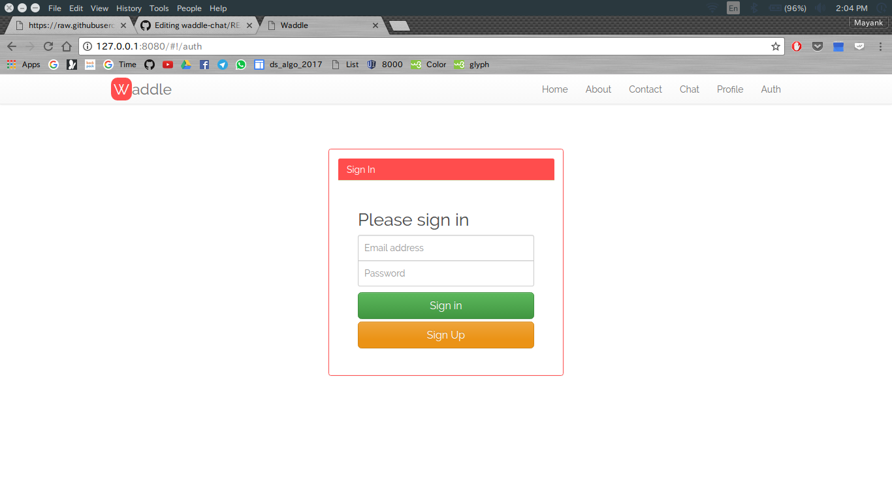
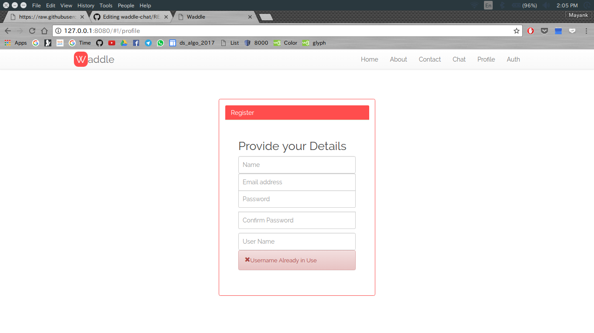
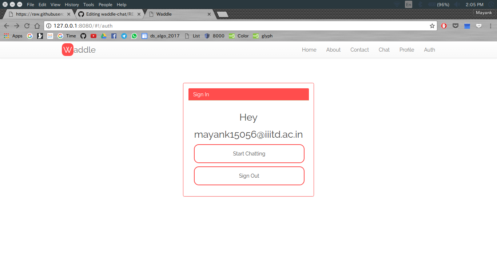
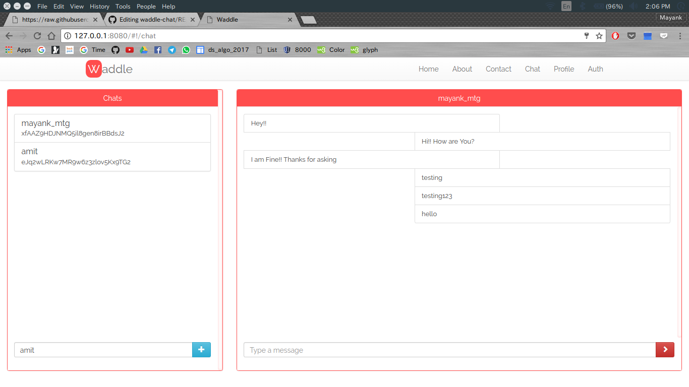
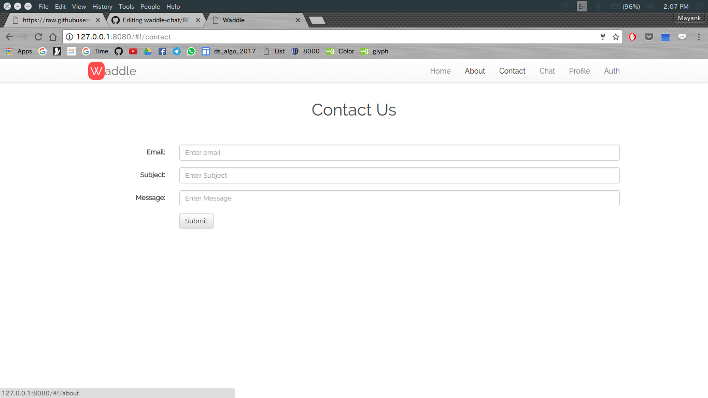

# waddle-chat

  
 
Chat Application

**Start Waddling**

# What is it?
Waddle Chat is the pre-eminent chat location for unlimited real-time chat experience.

View At : https://mayankmtg.github.io/waddle-chat/#!/home

## Aim
The main aim of the project is to:

- Develop an open-source chat experience for users.
- Deepen the understanding of Angular MVC framework.

## How to View
1. Host the application on any server (Hosting is important because of angular)
2. Click on Get Started
 
3. SignUp yourself

4. Enter details with a UNIQUE USERNAME

5. Start Chatting

6. Contact friends and type their usernames to add.

7. Click on any user and start chatting

8. Give feedback directly to admin for quality.

9. Read about the developer... :P

10. That it!

## Features
- **Real Time:** The Chat messages are sent instantly, that is in real time using the Firebase Real-Time Database.
- **Responsive:** The Web-App has a mobile site as well and is responsive to the screen size so that one does not have to lose information while using on their various electronic devices.
- **Security:** The rules for message viewing and sending does not involve encryption but since the communication with the database is secure, only the endd users can see the messages.
- **User-Name Chat:** Provides option to instantly add friends to your list and have a completely secure and private chatroom, only on the basis of usernames. Easy-as-Fxxx :P
- **Open Source:** The chat application is completely open source and is also user friendly. It is coded in the most naive sense and so is easy to understand. Code on Github.
- **Reliable:** Your sent messages shall be sent only when you are connected to internet.

## Technologies Used

- Angularfire
- Firebase
- HTML
- CSS
- Javascript
- AngularJS
- Bootstrap

